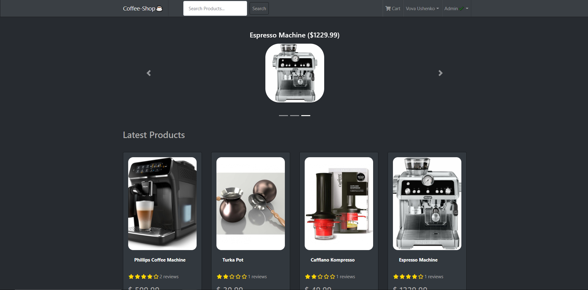

# Coffee-Shop-MERN (React / Redux / Node / MongoDB)
A simple and fast eCommerce platform. Fully written with *React Hooks*, *Redux* and *Node.js*.

# Demo
The app is hosted on Heroku. [**TRY IT IN ACTION!**](https://coffeeshopmernapp.herokuapp.com/)



# Features

- Full featured shopping cart
- Product reviews and ratings
- Top products carousel
- Product pagination
- Product search feature
- User profile with orders
- Admin product management
- Admin user management
- Admin Order details page
- Mark orders as delivered option
- Checkout process (shipping, payment method, etc)
- PayPal / credit card integration
- Custom database seeder script

# Tech Features
- [x] React with Functional Components & Hooks
- [x] React router
- [x] React-Bootstrap UI library
- [x] Managing global state with Redux (Actions & Reducers)
- [x] MongoDB and the Mongoose ODM
- [x] JWT authentication (JSON web tokens)
- [x] Integrating the PayPal API
- [x] Lazy Loading
- [x] Extensive back end with Express


# Todo ✔️
- [ ] Implement Lazy Loading
- [ ] Refactor code

# Development 💻
This app is created by using create-react-app. 
So you can simply install the dependencies:
```bash
$ npm i
```
And then start the development server:
```bash
$ npm run start 
```
# License 
MIT
